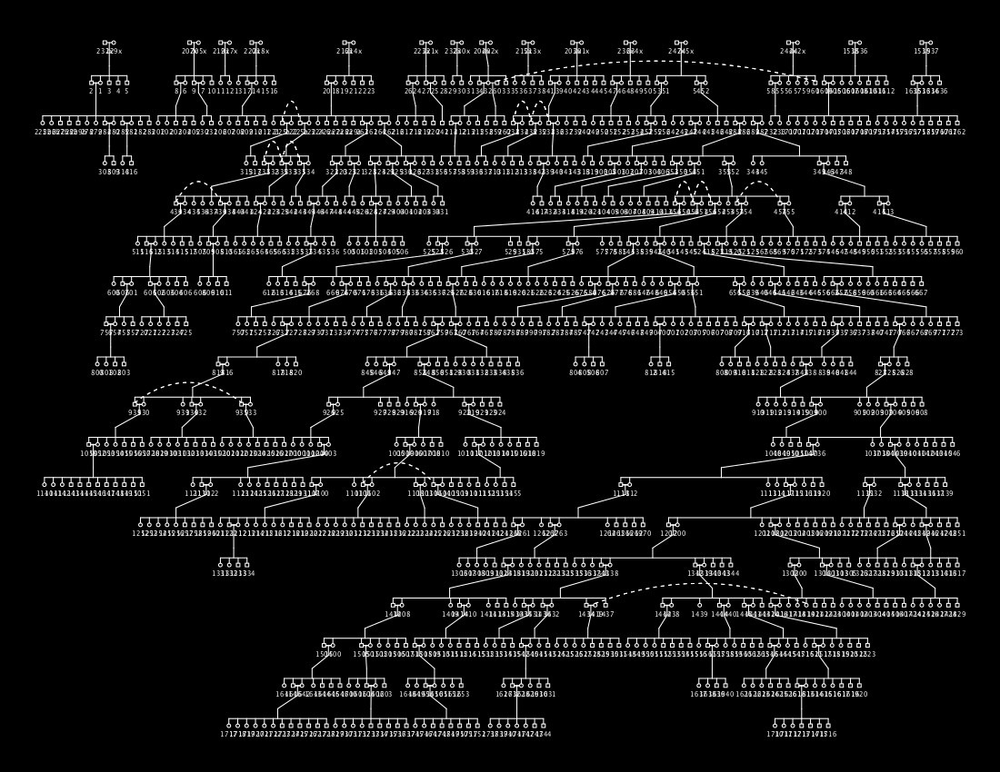

```{r setup, include=FALSE}
options(htmltools.dir.version = FALSE)
```

class: center, middle, inverse, title-slide

# Understanding Science News

## What do those statistics really say?

### Kevin M. Middleton, Ph.D.

#### Department of Pathology & Anatomical Sciences<br>University of Missouri School of Medicine

<br>


???

https://github.com/yihui/xaringan/wiki

---
class: inverse, center, middle

background-image: url(https://imgur.com/Llr41Sb.png)
background-size: contain

---
class: inverse, center, middle


---
class: inverse, center, middle


---
class: inverse, center, middle


---
class: inverse, center, middle



---
class: inverse, center, middle


---
class: inverse, center, middle


---
class: center, middle

## Why am I talking about statistics today?

---

# Statistics in your daily life

Example

Example

---

# Statistics affects you

Example

Example

---

# Inference, not statistics

## Making decisions based on data

---

# Example 1

---

# Example 2

---

# Being a skeptical statistical consumer

---

# Digging deeper

---

# Is most published research false?

---

# The perils of null hypothesis testing

---

# Chimera of Fisher and Neyman/Pearson

---

# Garden of forking paths

---

# Is all hope lost?

---

# ASA statement

---

# (Re)emergence of Bayesian inference

---

# Bayes history

---

# Your brain as a Bayesian engine

---

# Prior knowledge?

---

# Examples

---

# Being a good consumer
